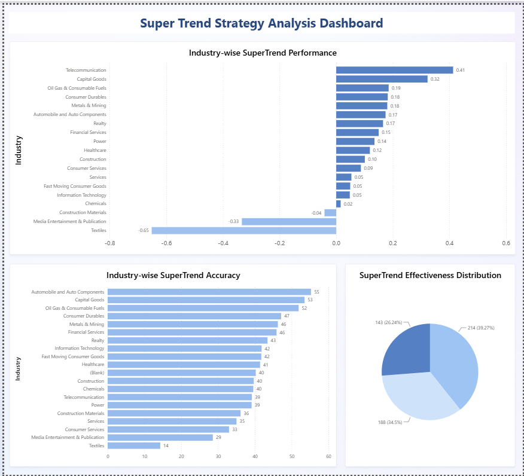

# SuperTrend Indicator Analysis - Indian Stock Market

[](https://www.python.org/)
[](https://www.postgresql.org/)
[](LICENSE)

**What:** Backtesting SuperTrend indicator on 500+ Indian stocks (2015-2024)  
**Why:** Evaluate if this technical indicator generates reliable trading signals  
**Status:** Historical backtesting only. No live trading.

## 🎯 Quick Overview

- **545 stocks** analyzed from NIFTY 500
- **62,716 trades** simulated with two parameter sets
- **41.58% average accuracy** (10,2 parameters)
- **10 years** of weekly price data (2015-2024)
- **5 sectors** show strong signals (Auto, Capital Goods, Oil & Gas)

## 🏗️ How It Works

```
1. Fetch Data      → Download 10 years of stock prices (Yahoo Finance)
2. Store Data      → Save in PostgreSQL + CSV files
3. Calculate       → Compute SuperTrend signals for each stock
4. Backtest        → Simulate trades and measure accuracy
5. Analyze         → Group results by sector and parameters
6. Visualize       → Create Power BI dashboard
```

## 📁 Repository Structure

| Folder | Purpose |
|--------|---------|
| `1_collection/` | Fetch stock prices from Yahoo Finance |
| `2_loading/` | Load data into PostgreSQL |
| `5_strategy/` | Calculate SuperTrend and backtest |
| `6_dashboard/` | Power BI visualization |
| `data/securities/` | Output results (CSV files) |
| `nse_history_csv/` | ~500 stock price CSV files |

## 📊 Key Results

| Metric | Value |
|--------|-------|
| Stocks Analyzed | 545 |
| Time Period | 2015-2024 (10 years) |
| Total Trades | 62,716 |
| **Average Accuracy** | 41.58% |
| Median Annual Return | 10.42% |
| Stocks Following Trend | 143 (26.2%) |
| Moderate Signals | 214 (39.3%) |
| Poor Signals | 188 (34.5%) |

## 🔬 Methodology (Simplified)

**SuperTrend Indicator:** Technical indicator that uses Average True Range (ATR) to identify trends

**How it works:**
1. Calculate ATR (volatility measure) over N periods
2. Set upper band = (High + Low)/2 + (ATR × Factor)
3. Set lower band = (High + Low)/2 - (ATR × Factor)
4. **BUY:** When price closes above upper band
5. **SELL:** When price closes below lower band

**Backtesting:**
- Applied to weekly prices
- Two parameter sets tested: (7,1) aggressive, (10,2) conservative
- Measured accuracy: % of trades with positive returns
- Grouped results by sector

## 📈 Best Performing Sectors

| Sector | Accuracy | Avg Return | Stocks |
|--------|----------|-----------|--------|
| Automobile | 55.24% | +0.17 | 7 |
| Capital Goods | 53.49% | +0.32 | 17 |
| Oil & Gas | 51.87% | +0.19 | 10 |
| Consumer Durables | 47.12% | +0.18 | 7 |
| Metals & Mining | 46.24% | +0.18 | 11 |

**Key Finding:** SuperTrend works better for stable, capital-heavy sectors. Tech and Consumer stocks show mixed results.

## 📊 Dashboard



Power BI dashboard shows:
- Sector-wise accuracy and returns
- Distribution of signal quality
- Individual stock performance

## 📌 Key Findings

1. **SuperTrend works best for stable sectors** - Automobile, Capital Goods, Oil & Gas show 50%+ accuracy
2. **Average accuracy is 41.58%** - Just above random chance, not ideal for standalone trading
3. **Parameter choice matters** - (10,2) fewer trades but slightly better accuracy than (7,1)
4. **Volatile sectors are challenging** - Tech, Consumer, and Media stocks show <35% accuracy
5. **Backtesting only** - No real-time validation, no transaction costs included

## ⚠️ Important Disclaimer

**Historical backtesting only.** This project analyzes past performance with no guarantees for future results. Do not use as sole basis for trading decisions. Always consult financial advisors before investing.

---

**Data:** 2015-2024 (10 years)  |  **Stocks:** 545  |  **Trades:** 62,716
